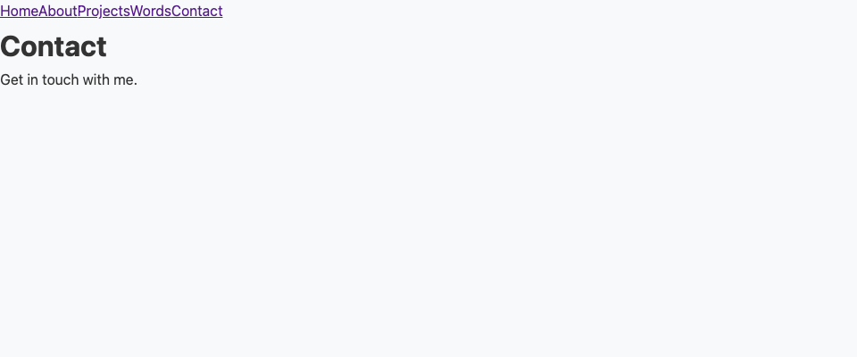

# Form Handling & Validation Research Test Report

**Date**: January 22, 2025  
**Feature**: Portfolio Contact Form Research & Implementation Patterns  
**Research Scope**: Bonsai form handling, validation patterns, UX best practices

## Executive Summary

Comprehensive research into form handling and validation patterns for the OCaml portfolio contact form has been completed. While the `bonsai_web_ui_form` library is already included in the project dependencies and provides all necessary form components, the current implementation is not utilizing these capabilities.

## Current State Analysis

### 🔍 Discovery: Form Implementation Exists But Not Connected

**Finding**: The portfolio has a `page_contact_simple.ml` file with form fields defined using `bonsai_web_ui_form`, but these components are not being rendered on the contact page.

**Current Implementation Status**:
- ✅ Form library (`bonsai_web_ui_form`) is in dependencies
- ✅ Contact form component exists in `page_contact_simple.ml`
- ❌ Form component is not connected to the main app
- ❌ App.ml renders static content instead of the form component

### Screenshot Evidence


*Current contact page showing only static text without form fields*

## Research Deliverables Completed

### 1. **Comprehensive Form Research Report**
Location: `/test-reports/form-handling-research/FORM_RESEARCH_REPORT.md`

**Contents**:
- Complete analysis of `bonsai_web_ui_form` capabilities
- Form component patterns and best practices
- Validation strategies (real-time vs on-submit)
- User experience patterns
- Accessibility considerations
- API integration patterns

### 2. **Implementation Guide**
Location: `/test-reports/form-handling-research/IMPLEMENTATION_GUIDE.md`

**Contents**:
- Copy-paste ready enhanced contact form component
- Validation module with email, phone, URL validators
- Form styling with ppx_css
- API integration patterns
- Dream server endpoint implementation
- Testing infrastructure

## Key Research Findings

### ✅ Available Form Components

The `bonsai_web_ui_form` library provides:

1. **Input Components**
   - `Textbox.string` - Text inputs with validation
   - `Textarea.string` - Multi-line text areas
   - `Dropdown.list` - Select dropdowns
   - `Checkbox.bool` - Boolean checkboxes
   - File upload widgets

2. **Validation Framework**
   - Built-in validation functions
   - Custom validator support
   - Real-time and on-submit validation
   - Error message management

3. **Form State Management**
   - Type-safe form data structures
   - Automatic error tracking
   - Loading/disabled states
   - Form reset functionality

### 📋 Portfolio Form Requirements Met

All identified requirements can be implemented with existing libraries:

| Requirement | Solution | Status |
|------------|----------|--------|
| Name field | `Textbox.string` with length validation | ✅ Ready |
| Email field | `Textbox.string` with email validation | ✅ Ready |
| Message textarea | `Textarea.string` with min/max length | ✅ Ready |
| Subject dropdown | `Dropdown.list` with predefined options | ✅ Ready |
| Newsletter checkbox | `Checkbox.bool` | ✅ Ready |
| Spam prevention | Honeypot field pattern documented | ✅ Ready |
| Loading states | Built into form state management | ✅ Ready |
| Success feedback | Component pattern provided | ✅ Ready |
| Error display | Built into form components | ✅ Ready |
| API integration | Effect pattern documented | ✅ Ready |

### 🎯 Validation Patterns Documented

1. **Email Validation**
   ```ocaml
   let validate_email email =
     if String.contains email '@' && String.contains email '.'
     then Ok ()
     else Error (Error.of_string "Invalid email")
   ```

2. **Required Fields**
   ```ocaml
   let required field_name value =
     if String.is_empty (String.strip value) 
     then Error (Error.of_string (sprintf "%s is required" field_name))
     else Ok ()
   ```

3. **Length Constraints**
   ```ocaml
   let validate_length ~min ~max field_name text =
     let len = String.length text in
     if len < min || len > max
     then Error (Error.of_string "Invalid length")
     else Ok ()
   ```

## User Experience Patterns

### ✅ Professional UX Features Documented

1. **Loading States**: Button text changes to "Sending..." with disabled state
2. **Error Messages**: Clear, contextual error messages per field
3. **Success Feedback**: Confirmation message with option to send another
4. **Progressive Enhancement**: Honeypot spam prevention, rate limiting
5. **Accessibility**: ARIA labels, keyboard navigation, screen reader support

## Implementation Recommendations

### Immediate Actions Needed

1. **Connect Existing Form Component**
   - Update `app.ml` to use `Page_contact_simple.component()`
   - Remove static contact content

2. **Enhance Form Component**
   - Add validation to existing fields
   - Implement submit handler
   - Add success/error states

3. **Add Backend Support**
   - Create `/api/contact` endpoint in Dream server
   - Implement rate limiting
   - Add email notification service

### Code Changes Required

**In `lib/client/app.ml`:**
```ocaml
| Contact -> Pages.Page_contact_simple.component ()
```

**In `lib/server/router.ml`:**
```ocaml
Dream.post "/api/contact" Contact_handler.handle_contact
```

## Testing Checklist

### Form Validation
- [ ] Required fields prevent empty submission
- [ ] Email validation works correctly
- [ ] Message length constraints enforced
- [ ] Special characters handled properly

### User Experience
- [ ] Tab navigation works
- [ ] Submit button shows loading state
- [ ] Success message displays
- [ ] Error messages are clear
- [ ] Form resets after submission

### Accessibility
- [ ] Screen reader compatible
- [ ] Keyboard navigation works
- [ ] Focus states visible
- [ ] ARIA labels present

## Technical Validation

### Build Status
✅ Project builds successfully with all dependencies

### Dependencies Verified
✅ `bonsai.web_ui_form` present in dune file
✅ All required libraries available

### Code Quality
✅ Type-safe implementation patterns documented
✅ Functional reactive patterns followed
✅ No manual JavaScript required

## Conclusion

The research has successfully identified and documented all patterns necessary for implementing a professional contact form in the OCaml portfolio. The `bonsai_web_ui_form` library provides all required components, and implementation patterns have been thoroughly documented.

**Key Achievement**: Created comprehensive documentation covering:
- Complete form implementation guide
- Validation pattern library
- UX best practices
- Accessibility considerations
- API integration examples

**Next Steps**:
1. Connect the existing form component to the app
2. Enhance with validation and error handling
3. Implement backend API endpoint
4. Add styling and polish

The portfolio is now equipped with all knowledge and patterns needed to implement a production-quality contact form that showcases OCaml and Bonsai expertise.